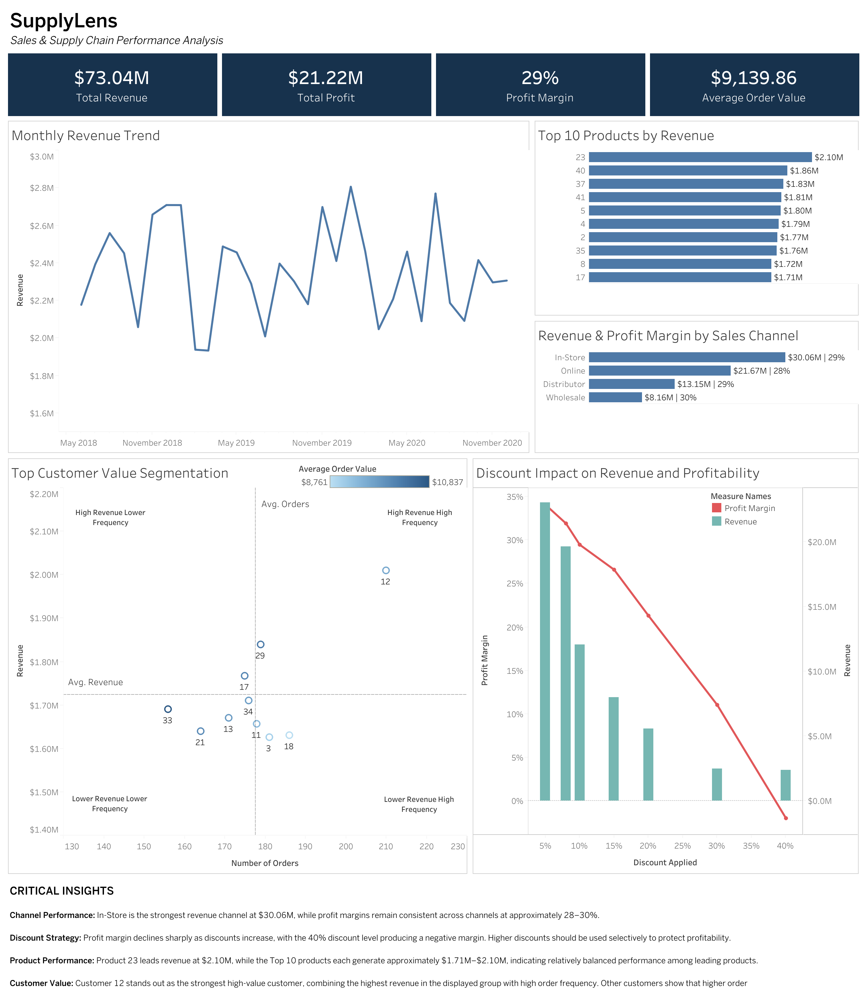

# SupplyLens | U.S. Regional Sales & Profitability Analysis

> An end-to-end business analysis project using **MySQL** and **Tableau** to identify revenue and profit drivers, evaluate discount strategy, analyze customer and product performance, and uncover opportunities to improve profitability.

---

## Project Overview

| | |
|---|---|
| **Business Focus** | Sales Performance & Profitability |
| **Tools** | MySQL, Tableau |
| **Dataset** | U.S. Regional Sales Data |
| **Analysis Period** | 2018–2020 |
| **Records Analyzed** | 7,991 |
| **Key Areas** | Revenue, Profitability, Discounts, Products, Customers, Sales Channels & Operations |

### Business Objective

The objective of this project was to identify the primary drivers of **revenue and profitability** and determine where the business could improve performance and prioritize resources.

The analysis focused on the following business questions:

1. What are the company's overall revenue, profit, and profit margin?
2. How has revenue changed over time?
3. How does discounting affect profitability?
4. Which products generate the most revenue and profit?
5. How does performance differ across sales channels?
6. Which customers provide the most value based on revenue, order frequency, and average order value?
7. How does sales performance vary across geographic areas?
8. How efficiently are orders processed from order to shipment?

---

## Executive Dashboard

### [View the Interactive Tableau Dashboard](https://public.tableau.com/app/profile/cody.o.brien6310/viz/SupplyLens_Sales_Analysis_Dashboard/Dashboard1)

The dashboard provides an executive view of business performance, including **$73.04M in revenue, $21.22M in profit, a 29% profit margin, and a $9.14K average order value**.

The dashboard also includes an interactive sales-channel action that allows users to explore how **product performance and discount behavior** differ across channels.

---

## Key Insights

The SQL exploratory analysis and Tableau dashboard produced several key findings:

| Area | Finding | Business Implication |
|---|---|---|
| **Discount Strategy** | Profit margin declines substantially as discounts increase, with the **40% discount tier producing a negative margin**. | High discount levels should be reviewed to prevent revenue growth from coming at the expense of profitability. |
| **Sales Channels** | **In-Store generated $30.06M**, the highest revenue of any sales channel, while channel margins remained approximately **28–30%**. | In-Store is a major revenue driver, while relatively similar margins make revenue volume an important differentiator between channels. |
| **Product Performance** | **Product 23 generated $2.10M**, the highest revenue among the products analyzed. | Leading products should receive appropriate inventory and sales support while the drivers behind their performance are investigated. |
| **Customer Value** | **Customer 12 emerged as a high-value customer**, while customer segmentation showed that higher order frequency does not necessarily translate into greater revenue. | Customer value should be evaluated using multiple measures rather than purchase frequency alone. |
| **Overall Performance** | The business generated **$73.04M in revenue and $21.22M in profit**, producing an overall **29% profit margin**. | Strong topline performance should continue to be evaluated alongside profitability to ensure sustainable growth. |

---

## Analysis Workflow

### 1. Data Preparation

The raw sales dataset was imported into MySQL and cleaned and validated before analysis.

Key preparation steps included:

- Created a backup table before modifying the source data
- Checked for duplicate records
- Audited null and blank values
- Standardized date fields and converted them to proper `DATE` data types
- Validated that delivery dates did not precede ship dates
- Converted unit cost and unit price fields to appropriate numeric data types
- Standardized column formatting and removed unnecessary whitespace
- Verified final record counts and data types before beginning analysis

### 2. SQL Exploratory Data Analysis

The cleaned dataset was analyzed in MySQL to investigate business performance across several areas:

- Total revenue and profit
- Profit margin by sales channel
- Top products by revenue and profitability
- Monthly revenue trends
- Discount impact on profit margin
- Customer order frequency and revenue
- Geographic performance
- Order processing time

The SQL analysis provided the foundation for identifying the most important findings to communicate through the Tableau dashboard.

### 3. Tableau Visualization

The results were translated into an executive-style Tableau dashboard featuring:

- **Total Revenue**
- **Total Profit**
- **Profit Margin**
- **Average Order Value**
- Monthly Revenue Trend
- Discount Impact on Revenue and Profitability
- Customer Value Segmentation
- Top 10 Products by Revenue
- Revenue and Profit Margin by Sales Channel
- Interactive sales-channel filtering
- Supporting tooltips and legends
- Critical business insights

---

## Business Recommendations

Based on the SQL analysis and dashboard findings, the following actions are recommended:

### 1. Establish Discount Guardrails

Review transactions at the highest discount levels and consider profitability thresholds before approving aggressive discounts. The negative margin associated with the 40% discount tier suggests that some discounted sales may generate revenue without generating sustainable profit.

### 2. Protect High-Performing Sales Channels

Maintain support for In-Store sales while evaluating opportunities to grow other channels without sacrificing profitability. Channel performance should be monitored using both revenue and margin rather than revenue alone.

### 3. Prioritize Leading Products

Ensure high-revenue products receive appropriate inventory and sales support while investigating the characteristics driving their performance. These findings can also help identify opportunities to improve lower-performing products.

### 4. Segment Customers Using Multiple Measures

Use revenue, order frequency, and average order value together when evaluating customer value. High purchasing frequency alone does not necessarily indicate the most valuable customer relationships.

### 5. Monitor Revenue Alongside Profitability

Evaluate revenue growth together with profit margin to ensure that higher sales translate into sustainable financial performance rather than growth driven by excessive discounting.

---

## Technical Skills Demonstrated

| MySQL | Tableau | Business Analysis |
|---|---|---|
| Data Cleaning | Dashboard Design | Revenue Analysis |
| Data Validation | KPI Development | Profitability Analysis |
| Aggregate Functions | Dual-Axis Charts | Customer Segmentation |
| `GROUP BY` & `CASE` | Reference Lines | Product Performance |
| Date Functions | Dashboard Actions | Discount Analysis |
| Exploratory Data Analysis | Interactive Tooltips | Business Recommendations |

---

## About This Project

SupplyLens demonstrates an end-to-end analytics workflow from **raw data preparation through business recommendations**.

MySQL was used to clean, validate, and explore the sales data, while Tableau was used to translate the most decision-relevant findings into an executive-facing dashboard. Together, the SQL analysis and Tableau visualization identify opportunities related to **profitability, discount strategy, customer value, product performance, sales channels, and operational performance**.
